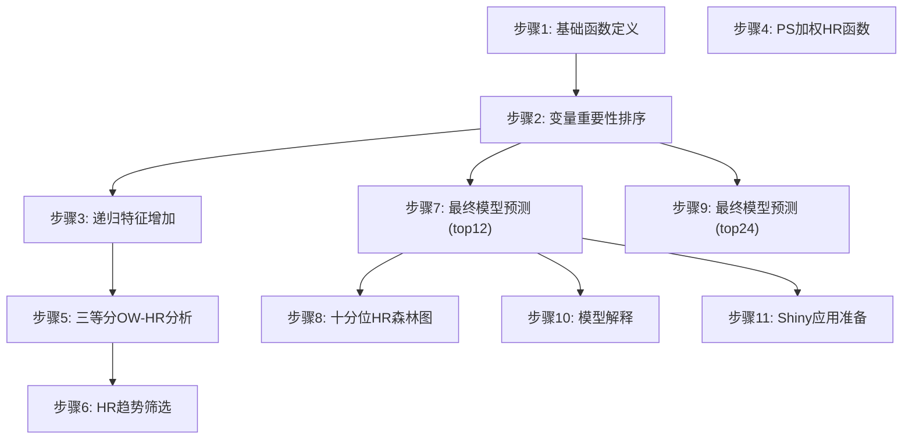

# HTE-HCC-TACE 演示代码

## 项目核心功能介绍

本项目是一个**肝细胞癌（HCC）经动脉化疗栓塞（TACE）治疗异质性（HTE）分析系统**，采用机器学习方法预测个体化治疗效果（CATE，条件平均治疗效应）。

### 主要功能

1. **变量重要性排序**：基于 RMST-Qini 指标评估各临床变量对治疗异质性的贡献
2. **多算法递归特征增加**：使用 `survlearners` 包中的多种算法（Lasso、GRF、CoxPH 等）进行特征选择
3. **最终模型训练与预测**：使用 `surv_fl_grf`（因果生存森林）训练最终模型，预测患者级 CATE
4. **十分位 HR 验证**：按 CATE 将患者分组，验证治疗效果的异质性
5. **模型解释**：基于 DALEX、SHAP 等方法提供全局和局部解释

### 分析流程



---

## 演示环境部署要求

### 系统要求

- **操作系统**：Windows 10/11、macOS 10.15+、Linux（Ubuntu 18.04+）
- **R 版本**：R 4.1.0 或更高版本（推荐 R 4.3.0+）
- **内存**：至少 8GB RAM（推荐 16GB）
- **磁盘空间**：至少 2GB 可用空间

### R 包依赖

本项目依赖以下 R 包，按安装优先级排列：

**核心依赖包**：

- `pacman`：包管理器
- `tidyverse`：数据处理套件
- `openxlsx`：Excel 文件读写
- `here`：项目路径管理

**统计建模包**：

- `grf`：广义随机森林（用于 PS 估计和因果森林）
- `survlearners`：生存学习器（核心 CATE 算法）
- `survival`：生存分析基础包

**机器学习与解释包**：

- `DALEX`：模型解释框架
- `ingredients`：模型解释组件
- `kernelshap`：SHAP 值计算
- `shapviz`：SHAP 可视化
- `glmnet`：正则化回归
- `xgboost`：梯度提升树
- `ranger`：随机森林
- `e1071`：支持向量机

---

## 从依赖安装到启动演示的全流程指南

### 第一步：安装 R 和 RStudio

1. 下载并安装 R：https://cran.r-project.org/
2. 下载并安装 RStudio（可选）：https://posit.co/downloads/

### 第二步：验证 R 安装

打开命令行（PowerShell/Terminal），执行：

```bash
Rscript --version
```

应显示 R 版本信息，例如 `R scripting front-end version 4.3.x`

### 第三步：安装依赖包

在 R 或 RStudio 控制台中执行：

```r
# 安装 pacman 包管理器
install.packages("pacman")

# 使用 pacman 批量安装依赖
pacman::p_load(
  tidyverse,
  openxlsx,
  here,
  grf,
  survival,
  DALEX,
  ingredients,
  kernelshap,
  shapviz,
  glmnet,
  xgboost,
  ranger,
  e1071
)
```

### 第四步：进入演示目录

```bash
cd /path/to/HTE-HCC-TACE_V3/demo
```

### 第五步：生成测试数据

```bash
Rscript generate_test_data.R
```

此脚本将生成：

- `test_data/01_ISMIO2501_train_tidy.xlsx`（训练集，300 样本）
- `test_data/02_ISMIO2501_validation_tidy.xlsx`（验证集，200 样本）
- `test_data/03_ISMIO2501prevalidation_tidy.xlsx`（前验证集，150 样本）
- `test_data/PS变量最终确定.txt`（PS 变量定义文件）

### 第六步：运行演示脚本（可选）

```bash
Rscript demo_run.R
```

此脚本将检查环境并输出使用说明。

---

## 各功能模块的演示操作步骤

### 模块 1：变量重要性排序（步骤 2）

**功能**：逐变量计算 RMST-Qini 指标，评估变量对治疗异质性的贡献

**运行命令**：

```bash
cd code
Rscript 2-rmst24_qini_rank_by_variable_train.R
```

**输出文件**：

- `output/2-rmst24_qini_rank_by_variable_train/06_rmst24_qini_by_variable_ranked_train.csv`

**运行时间**：约 5-15 分钟（取决于样本量和变量数）

---

### 模块 2：递归特征增加（步骤 3）

**功能**：按变量重要性顺序逐步增加特征，使用多种生存学习器算法拟合 CATE 模型

**运行命令**：

```bash
Rscript 3-survlearners_recursive_feature_growth.R
```

**输出文件**：

- `output/3-survlearners_recursive_feature_growth/07_survlearners_recursive_feature_growth_all_algorithms.csv`
- `output/3-survlearners_recursive_feature_growth/08_survlearners_recursive_feature_growth_all_algorithms_patient_cate.csv`

**运行时间**：约 30-60 分钟（取决于算法数量和特征数）

---

### 模块 3：三等分 OW-HR 分析（步骤 5）

**功能**：按 CATE 三等分患者，在每个分组内计算 OW 加权 Cox HR

**运行命令**：

```bash
Rscript 5-survlearners_tertile_ow_neglogp_sum.R
```

**输出文件**：

- `output/5-survlearners_tertile_ow_neglogp_sum/06_survlearners_tertile_ow_hr_p_results.csv`

---

### 模块 4：HR 趋势筛选（步骤 6）

**功能**：根据 HR 趋势规则筛选最优算法和特征组合

**运行命令**：

```bash
Rscript 6-hr_trend_screening.R
```

**输出文件**：

- `output/6-hr_trend_screening/04_hr_trend_top_candidates.csv`

---

### 模块 5：最终模型预测 - top12（步骤 7）

**功能**：使用前 12 个变量训练最终模型，并在三个数据集上预测 CATE

**运行命令**：

```bash
Rscript 7-final_surv_fl_grf_top12_predict.R
```

**输出文件**：

- `output/7-final_surv_fl_grf_top12_predict/06_train_with_cate.xlsx`
- `output/7-final_surv_fl_grf_top12_predict/07_validation_with_cate.xlsx`
- `output/7-final_surv_fl_grf_top12_predict/08_prevalidation_with_cate.xlsx`

**运行时间**：约 10-20 分钟

---

### 模块 6：十分位 HR 森林图（步骤 8）

**功能**：按 CATE 十分位分组，绘制 OW/IPW/未调整 HR 森林图

**运行命令**：

```bash
Rscript 8-cate_decile_hr_forest.R
```

**输出文件**：

- `output/8-cate_decile_hr_forest/09_train_cate_decile_hr_forest.png`
- `output/8-cate_decile_hr_forest/10_validation_cate_decile_hr_forest.png`

---

### 模块 7：最终模型预测 - top24（步骤 9）

**功能**：使用前 24 个变量训练最终模型

**运行命令**：

```bash
Rscript 9-surv_fl_grf_top24_train_and_decile.R
```

---

### 模块 8：模型解释（步骤 10）

**功能**：使用 surrogate 模型和 SHAP 方法解释最终模型

**运行命令**：

```bash
Rscript 10-cate_surrogate_models_explain.R
```

**输出文件**：

- `output/explain/` 目录下包含各模型的 SHAP 图和变量重要性图

**运行时间**：约 20-40 分钟

---

### 模块 9：Shiny 应用准备（步骤 11）

**功能**：为 Shiny Web 应用准备模型工件

**运行命令**：

```bash
Rscript 11-prepare_shiny_final_model_app_artifacts.R
```

**输出文件**：

- `output/shiny_final_model_app/final_model_shiny_artifact.rds`

---

## 常见问题排查

### 问题 1：Rscript 命令不可用

**症状**：`Rscript: command not found`

**解决方案**：

1. 确认 R 已正确安装
2. 将 R 的 bin 目录添加到系统 PATH
3. Windows：通常位于 `C:\Program Files\R\R-4.x.x\bin\`

---

### 问题 2：包安装失败

**症状**：`package 'xxx' is not available`

**解决方案**：

1. 检查网络连接
2. 尝试使用国内镜像源：
   ```r
   options(repos = c(CRAN = "https://mirrors.tuna.tsinghua.edu.cn/CRAN/"))
   ```
3. 对于 `survlearners`、`grf` 等 GitHub 包：
   ```r
   install.packages("remotes")
   remotes::install_github("grf-labs/grf")
   remotes::install_github("grf-labs/survlearners")
   ```

---

### 问题 3：内存不足

**症状**：`cannot allocate vector of size xxx Mb`

**解决方案**：

1. 增加 R 的内存限制：
   ```r
   memory.limit(size = 16000)  # Windows
   ```
2. 减少样本量（修改 `generate_test_data.R` 中的 n 参数）
3. 使用 64 位 R

---

### 问题 4：here() 路径错误

**症状**：`here()` 返回错误路径

**解决方案**：

1. 确保在项目根目录（包含 `.here` 文件的目录）下运行
2. 手动设置工作目录：
   ```r
   setwd("/path/to/HTE-HCC-TACE_V3/demo")
   ```

---

### 问题 5：Excel 文件读取失败

**症状**：`Error in read.xlsx: xxx`

**解决方案**：

1. 确认文件存在且未损坏
2. 检查文件是否被其他程序占用
3. 确认 `openxlsx` 包已正确安装

---

### 问题 6：survlearners 函数不存在

**症状**：`Error in surv_fl_grf: could not find function`

**解决方案**：

1. 确认 `survlearners` 包已安装：
   ```r
   library(survlearners)
   ls("package:survlearners")
   ```
2. 如果函数不存在，可能需要从 GitHub 安装最新版本

---

### 问题 7：随机种子不一致

**症状**：多次运行结果不同

**解决方案**：

1. 确保在脚本开头设置随机种子：
   ```r
   set.seed(20260423)
   ```
2. 确保使用相同版本的 R 和依赖包

---

### 问题 8：输出目录不存在

**症状**：`Error in file: cannot open the connection`

**解决方案**：

1. 手动创建输出目录：
   ```r
   dir.create("output", recursive = TRUE)
   ```

---

## 目录结构说明

```
demo/
├── README.md                          # 本说明文档
├── generate_test_data.R               # 测试数据生成脚本
├── demo_run.R                         # 演示运行脚本
├── code/                              # 原始代码（完整复刻）
│   ├── 1-rmst_hte_qini_fun.R         # 基础函数定义
│   ├── 2-rmst24_qini_rank_by_variable_train.R
│   ├── 3-survlearners_recursive_feature_growth.R
│   ├── 4-ps_weighted_hr_function.R
│   ├── 5-survlearners_tertile_ow_neglogp_sum.R
│   ├── 6-hr_trend_screening.R
│   ├── 7-final_surv_fl_grf_top12_predict.R
│   ├── 8-cate_decile_hr_forest.R
│   ├── 9-surv_fl_grf_top24_train_and_decile.R
│   ├── 10-cate_surrogate_models_explain.R
│   ├── 11-prepare_shiny_final_model_app_artifacts.R
│   └── analysis_pipeline_and_dalex_interpretation_plan.md
├── test_data/                         # 模拟测试数据
│   ├── 01_ISMIO2501_train_tidy.xlsx
│   ├── 02_ISMIO2501_validation_tidy.xlsx
│   ├── 03_ISMIO2501prevalidation_tidy.xlsx
│   └── PS变量最终确定.txt
└── output/                            # 演示输出目录（运行后生成）
```

---

## 与原项目的关系

- **代码完全复刻**：`code/` 目录包含原项目所有原始代码，未做任何修改
- **数据完全隔离**：`test_data/` 包含独立生成的模拟数据，不覆盖原项目数据
- **输出完全隔离**：所有结果输出到 `demo/output/`，不影响原项目

---

## 快速开始

```bash
# 1. 进入演示目录
cd /path/to/HTE-HCC-TACE_V3/demo

# 2. 生成测试数据
Rscript generate_test_data.R

# 3. 运行变量重要性排序（最核心的步骤）
cd code
Rscript 2-rmst24_qini_rank_by_variable_train.R

# 4. 查看结果
cat output/2-rmst24_qini_rank_by_variable_train/06_rmst24_qini_by_variable_ranked_train.csv
```

---

## 联系方式

如有问题或建议，请通过以下方式联系：

- 项目仓库：[GitHub 链接]
- 邮箱：[联系邮箱]

---

## 许可证

本演示代码遵循 [MIT License](LICENSE) 开源协议。
