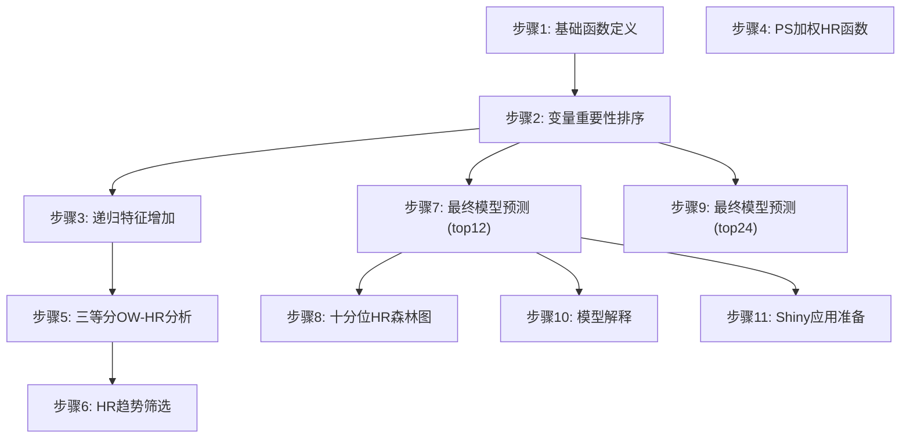
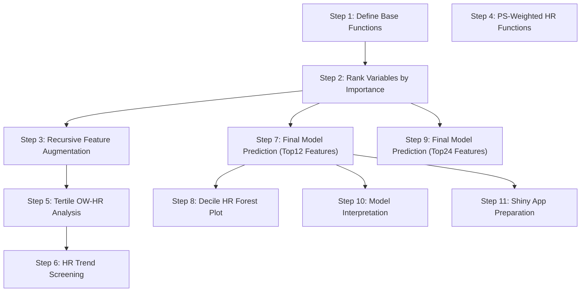

# 中文版说明

# HTE-HCC-TACE 演示代码

## 项目核心功能介绍

本项目是一个**肝细胞癌（HCC）经动脉化疗栓塞（TACE）治疗异质性（HTE）分析系统**，采用机器学习方法预测个体化治疗效果（CATE，条件平均治疗效应）。

- 无代码的shiny在线版本：https://zhangkaimedicalapp.shinyapps.io/hcc-tace-treatment-recommendation/

### 主要功能

1. **变量重要性排序**：基于 RMST-Qini 指标评估各临床变量对治疗异质性的贡献
2. **多算法递归特征增加**：使用 `survlearners` 包中的多种算法（Lasso、GRF、CoxPH 等）进行特征选择
3. **最终模型训练与预测**：使用 `surv_fl_grf`（因果生存森林）训练最终模型，预测患者级 CATE
4. **十分位 HR 验证**：按 CATE 将患者分组，验证治疗效果的异质性
5. **模型解释**：基于 DALEX、SHAP 等方法提供全局和局部解释

### 分析流程



---

## 演示环境部署要求

### 系统要求

- **操作系统**：Windows 10/11、macOS 10.15+、Linux（Ubuntu 18.04+）
- **R 版本**：R 4.1.0 或更高版本（推荐 R 4.3.0+）
- **内存**：至少 8GB RAM（推荐 16GB）
- **磁盘空间**：至少 2GB 可用空间

### R 包依赖

本项目依赖以下 R 包，按安装优先级排列：

**核心依赖包**：

- `pacman`：包管理器
- `tidyverse`：数据处理套件
- `openxlsx`：Excel 文件读写
- `here`：项目路径管理

**统计建模包**：

- `grf`：广义随机森林（用于 PS 估计和因果森林）
- `survlearners`：生存学习器（核心 CATE 算法）
- `survival`：生存分析基础包

**机器学习与解释包**：

- `DALEX`：模型解释框架
- `ingredients`：模型解释组件
- `kernelshap`：SHAP 值计算
- `shapviz`：SHAP 可视化
- `glmnet`：正则化回归
- `xgboost`：梯度提升树
- `ranger`：随机森林
- `e1071`：支持向量机

---

## 从依赖安装到启动演示的全流程指南

### 第一步：安装 R 和 RStudio

1. 下载并安装 R：https://cran.r-project.org/
2. 下载并安装 RStudio（可选）：https://posit.co/downloads/

### 第二步：验证 R 安装

打开命令行（PowerShell/Terminal），执行：

```bash
Rscript --version
```

应显示 R 版本信息，例如 `R scripting front-end version 4.3.x`

### 第三步：安装依赖包

在 R 或 RStudio 控制台中执行：

```r
# 安装 pacman 包管理器
install.packages("pacman")

# 使用 pacman 批量安装依赖
pacman::p_load(
  tidyverse,
  openxlsx,
  here,
  grf,
  survival,
  DALEX,
  ingredients,
  kernelshap,
  shapviz,
  glmnet,
  xgboost,
  ranger,
  e1071
)
```

### 第四步：进入演示目录

```bash
cd /path/to/HTE-HCC-TACE_V3/demo
```

### 第五步：生成测试数据

```bash
Rscript generate_test_data.R
```

此脚本将生成：

- `test_data/01_ISMIO2501_train_tidy.xlsx`（训练集，300 样本）
- `test_data/02_ISMIO2501_validation_tidy.xlsx`（验证集，200 样本）
- `test_data/03_ISMIO2501prevalidation_tidy.xlsx`（前验证集，150 样本）
- `test_data/PS变量最终确定.txt`（PS 变量定义文件）

### 第六步：运行演示脚本（可选）

```bash
Rscript demo_run.R
```

此脚本将检查环境并输出使用说明。

---

## 各功能模块的演示操作步骤

### 模块 1：变量重要性排序（步骤 2）

**功能**：逐变量计算 RMST-Qini 指标，评估变量对治疗异质性的贡献

**运行命令**：

```bash
cd code
Rscript 2-rmst24_qini_rank_by_variable_train.R
```

**输出文件**：

- `output/2-rmst24_qini_rank_by_variable_train/06_rmst24_qini_by_variable_ranked_train.csv`

**运行时间**：约 5-15 分钟（取决于样本量和变量数）

---

### 模块 2：递归特征增加（步骤 3）

**功能**：按变量重要性顺序逐步增加特征，使用多种生存学习器算法拟合 CATE 模型

**运行命令**：

```bash
Rscript 3-survlearners_recursive_feature_growth.R
```

**输出文件**：

- `output/3-survlearners_recursive_feature_growth/07_survlearners_recursive_feature_growth_all_algorithms.csv`
- `output/3-survlearners_recursive_feature_growth/08_survlearners_recursive_feature_growth_all_algorithms_patient_cate.csv`

**运行时间**：约 30-60 分钟（取决于算法数量和特征数）

---

### 模块 3：三等分 OW-HR 分析（步骤 5）

**功能**：按 CATE 三等分患者，在每个分组内计算 OW 加权 Cox HR

**运行命令**：

```bash
Rscript 5-survlearners_tertile_ow_neglogp_sum.R
```

**输出文件**：

- `output/5-survlearners_tertile_ow_neglogp_sum/06_survlearners_tertile_ow_hr_p_results.csv`

---

### 模块 4：HR 趋势筛选（步骤 6）

**功能**：根据 HR 趋势规则筛选最优算法和特征组合

**运行命令**：

```bash
Rscript 6-hr_trend_screening.R
```

**输出文件**：

- `output/6-hr_trend_screening/04_hr_trend_top_candidates.csv`

---

### 模块 5：最终模型预测 - top12（步骤 7）

**功能**：使用前 12 个变量训练最终模型，并在三个数据集上预测 CATE

**运行命令**：

```bash
Rscript 7-final_surv_fl_grf_top12_predict.R
```

**输出文件**：

- `output/7-final_surv_fl_grf_top12_predict/06_train_with_cate.xlsx`
- `output/7-final_surv_fl_grf_top12_predict/07_validation_with_cate.xlsx`
- `output/7-final_surv_fl_grf_top12_predict/08_prevalidation_with_cate.xlsx`

**运行时间**：约 10-20 分钟

---

### 模块 6：十分位 HR 森林图（步骤 8）

**功能**：按 CATE 十分位分组，绘制 OW/IPW/未调整 HR 森林图

**运行命令**：

```bash
Rscript 8-cate_decile_hr_forest.R
```

**输出文件**：

- `output/8-cate_decile_hr_forest/09_train_cate_decile_hr_forest.png`
- `output/8-cate_decile_hr_forest/10_validation_cate_decile_hr_forest.png`

---

### 模块 7：最终模型预测 - top24（步骤 9）

**功能**：使用前 24 个变量训练最终模型

**运行命令**：

```bash
Rscript 9-surv_fl_grf_top24_train_and_decile.R
```

---

### 模块 8：模型解释（步骤 10）

**功能**：使用 surrogate 模型和 SHAP 方法解释最终模型

**运行命令**：

```bash
Rscript 10-cate_surrogate_models_explain.R
```

**输出文件**：

- `output/explain/` 目录下包含各模型的 SHAP 图和变量重要性图

**运行时间**：约 20-40 分钟

---

### 模块 9：Shiny 应用准备（步骤 11）

**功能**：为 Shiny Web 应用准备模型工件

**运行命令**：

```bash
Rscript 11-prepare_shiny_final_model_app_artifacts.R
```

**输出文件**：

- `output/shiny_final_model_app/final_model_shiny_artifact.rds`

---


## 目录结构说明

```
demo/
├── README.md                          # 本说明文档
├── generate_test_data.R               # 测试数据生成脚本
├── demo_run.R                         # 演示运行脚本
├── code/                              # 原始代码（完整复刻）
│   ├── 1-rmst_hte_qini_fun.R         # 基础函数定义
│   ├── 2-rmst24_qini_rank_by_variable_train.R
│   ├── 3-survlearners_recursive_feature_growth.R
│   ├── 4-ps_weighted_hr_function.R
│   ├── 5-survlearners_tertile_ow_neglogp_sum.R
│   ├── 6-hr_trend_screening.R
│   ├── 7-final_surv_fl_grf_top12_predict.R
│   ├── 8-cate_decile_hr_forest.R
│   ├── 9-surv_fl_grf_top24_train_and_decile.R
│   ├── 10-cate_surrogate_models_explain.R
│   ├── 11-prepare_shiny_final_model_app_artifacts.R
│   └── analysis_pipeline_and_dalex_interpretation_plan.md
├── test_data/                         # 模拟测试数据
│   ├── 01_ISMIO2501_train_tidy.xlsx
│   ├── 02_ISMIO2501_validation_tidy.xlsx
│   ├── 03_ISMIO2501prevalidation_tidy.xlsx
│   └── PS变量最终确定.txt
└── output/                            # 演示输出目录（运行后生成）
```

---

## 与原项目的关系

- **代码完全复刻**：`code/` 目录包含原项目所有原始代码，未做任何修改
- **数据完全隔离**：`test_data/` 包含独立生成的模拟数据，不覆盖原项目数据
- **输出完全隔离**：所有结果输出到 `demo/output/`，不影响原项目


# HTE-HCC-TACE Demo Code
## Project Core Function Overview
This project is a **Hepatocellular Carcinoma (HCC) Transarterial Chemoembolization (TACE) Treatment Heterogeneity (HTE) Analysis System**, which employs machine learning to predict individualized treatment effects (CATE, Conditional Average Treatment Effect).

- No-code Shiny online version: https://zhangkaimedicalapp.shinyapps.io/hcc-tace-treatment-recommendation/

### Key Functions
1. **Variable Importance Ranking**: Evaluate the contribution of each clinical variable to treatment heterogeneity based on the RMST-Qini metric
2. **Multi-Algorithm Recursive Feature Augmentation**: Perform feature selection using multiple algorithms from the `survlearners` package (Lasso, GRF, CoxPH, etc.)
3. **Final Model Training & Prediction**: Train the final model with `surv_fl_grf` (Causal Survival Forest) to generate patient-level CATE predictions
4. **Decile HR Validation**: Stratify patients by CATE values to validate heterogeneity of treatment effects
5. **Model Interpretation**: Provide global and local explanations via DALEX, SHAP and other methodologies

### Analysis Workflow


---

## Demo Environment Deployment Requirements
### System Requirements
- **Operating System**: Windows 10/11, macOS 10.15+, Linux (Ubuntu 18.04+)
- **R Version**: R 4.1.0 or higher (R 4.3.0+ recommended)
- **RAM**: Minimum 8GB (16GB recommended)
- **Disk Space**: At least 2GB free storage

### R Package Dependencies
All required R packages listed below, sorted by installation priority:

**Core Utility Packages**:
- `pacman`: Package manager
- `tidyverse`: Integrated data processing suite
- `openxlsx`: Read/write Excel files
- `here`: Project path management

**Statistical Modeling Packages**:
- `grf`: Generalized Random Forest (for propensity score estimation & causal forest)
- `survlearners`: Survival learning library (core CATE algorithm toolkit)
- `survival`: Foundation package for survival analysis

**Machine Learning & Model Interpretation Packages**:
- `DALEX`: Unified model explanation framework
- `ingredients`: Supporting components for model interpretation
- `kernelshap`: Efficient SHAP value computation
- `shapviz`: SHAP visualization toolkit
- `glmnet`: Regularized regression
- `xgboost`: Gradient boosting decision trees
- `ranger`: Fast random forest implementation
- `e1071`: Support vector machine & miscellaneous ML utilities

---

## Full Step-by-Step Guide: From Dependency Installation to Demo Launch
### Step 1: Install R and RStudio
1. Download and install base R: https://cran.r-project.org/
2. Download and install RStudio (optional IDE): https://posit.co/downloads/

### Step 2: Verify R Installation
Open your terminal (PowerShell / Terminal) and run:
```bash
Rscript --version
```
A valid installation will output your R version, e.g. `R scripting front-end version 4.3.x`

### Step 3: Install Dependent R Packages
Execute the following code in your R or RStudio console:
```r
# Install pacman package manager first
install.packages("pacman")

# Bulk install all required packages via pacman
pacman::p_load(
  tidyverse,
  openxlsx,
  here,
  grf,
  survival,
  DALEX,
  ingredients,
  kernelshap,
  shapviz,
  glmnet,
  xgboost,
  ranger,
  e1071
)
```

### Step 4: Navigate to Demo Directory
```bash
cd /path/to/HTE-HCC-TACE_V3/demo
```

### Step 5: Generate Synthetic Test Dataset
```bash
Rscript generate_test_data.R
```
This script outputs the following files:
- `test_data/01_ISMIO2501_train_tidy.xlsx` (Training set, 300 samples)
- `test_data/02_ISMIO2501_validation_tidy.xlsx` (Validation set, 200 samples)
- `test_data/03_ISMIO2501prevalidation_tidy.xlsx` (Pre-validation set, 150 samples)
- `test_data/PS_variable_definitions.txt` (Propensity score variable dictionary)

### Step 6: Run Demo Entry Script (Optional)
```bash
Rscript demo_run.R
```
This script validates your runtime environment and prints usage instructions.

---

## Module-by-Module Demo Operation Guide
### Module 1: Variable Importance Ranking (Step 2)
**Function**: Calculate RMST-Qini metrics for each predictor to quantify its impact on treatment heterogeneity
**Run Command**:
```bash
cd code
Rscript 2-rmst24_qini_rank_by_variable_train.R
```
**Output Files**:
- `output/2-rmst24_qini_rank_by_variable_train/06_rmst24_qini_by_variable_ranked_train.csv`
**Runtime**: ~5–15 minutes (varies with sample size and predictor count)

---

### Module 2: Recursive Feature Augmentation (Step 3)
**Function**: Iteratively add predictors ordered by importance, and fit CATE models with multiple survival learning algorithms
**Run Command**:
```bash
Rscript 3-survlearners_recursive_feature_growth.R
```
**Output Files**:
- `output/3-survlearners_recursive_feature_growth/07_survlearners_recursive_feature_growth_all_algorithms.csv`
- `output/3-survlearners_recursive_feature_growth/08_survlearners_recursive_feature_growth_all_algorithms_patient_cate.csv`
**Runtime**: ~30–60 minutes (varies with algorithm count and feature pool size)

---

### Module 3: Tertile OW-HR Analysis (Step 5)
**Function**: Stratify patients into 3 equal CATE subgroups, and compute OW-weighted Cox hazard ratios within each stratum
**Run Command**:
```bash
Rscript 5-survlearners_tertile_ow_neglogp_sum.R
```
**Output Files**:
- `output/5-survlearners_tertile_ow_neglogp_sum/06_survlearners_tertile_ow_hr_p_results.csv`

---

### Module 4: HR Trend Screening (Step 6)
**Function**: Filter optimal algorithm & feature combinations by predefined hazard ratio monotonicity criteria
**Run Command**:
```bash
Rscript 6-hr_trend_screening.R
```
**Output Files**:
- `output/6-hr_trend_screening/04_hr_trend_top_candidates.csv`

---

### Module 5: Final Model Prediction — Top12 Features (Step 7)
**Function**: Train final causal survival forest model on the top 12 most predictive variables, generate CATE predictions across all three datasets
**Run Command**:
```bash
Rscript 7-final_surv_fl_grf_top12_predict.R
```
**Output Files**:
- `output/7-final_surv_fl_grf_top12_predict/06_train_with_cate.xlsx`
- `output/7-final_surv_fl_grf_top12_predict/07_validation_with_cate.xlsx`
- `output/7-final_surv_fl_grf_top12_predict/08_prevalidation_with_cate.xlsx`
**Runtime**: ~10–20 minutes

---

### Module 6: CATE Decile HR Forest Plot (Step 8)
**Function**: Split patients into 10 CATE quantiles, generate forest plots comparing crude, OW-weighted, and IPW-adjusted hazard ratios
**Run Command**:
```bash
Rscript 8-cate_decile_hr_forest.R
```
**Output Files**:
- `output/8-cate_decile_hr_forest/09_train_cate_decile_hr_forest.png`
- `output/8-cate_decile_hr_forest/10_validation_cate_decile_hr_forest.png`

---

### Module 7: Final Model Prediction — Top24 Features (Step 9)
**Function**: Train causal survival forest model using the top 24 ranked predictors
**Run Command**:
```bash
Rscript 9-surv_fl_grf_top24_train_and_decile.R
```

---

### Module 8: Model Interpretation (Step 10)
**Function**: Generate surrogate explanation models and compute SHAP values to interpret the final CATE estimator
**Run Command**:
```bash
Rscript 10-cate_surrogate_models_explain.R
```
**Output Files**:
- SHAP summary plots, partial dependence plots, and variable importance charts stored under `output/explain/`
**Runtime**: ~20–40 minutes

---

### Module 9: Shiny Web Application Preparation (Step 11)
**Function**: Export serialized model artifacts required for deployment of the interactive Shiny web app
**Run Command**:
```bash
Rscript 11-prepare_shiny_final_model_app_artifacts.R
```
**Output Files**:
- `output/shiny_final_model_app/final_model_shiny_artifact.rds`

---

## Directory Structure Overview
```
demo/
├── README.md                          # This documentation file
├── generate_test_data.R               # Synthetic dataset generation script
├── demo_run.R                         # Main demo entry validation script
├── code/                              # Full unmodified source code archive
│   ├── 1-rmst_hte_qini_fun.R         # Base metric & utility function definitions
│   ├── 2-rmst24_qini_rank_by_variable_train.R
│   ├── 3-survlearners_recursive_feature_growth.R
│   ├── 4-ps_weighted_hr_function.R
│   ├── 5-survlearners_tertile_ow_neglogp_sum.R
│   ├── 6-hr_trend_screening.R
│   ├── 7-final_surv_fl_grf_top12_predict.R
│   ├── 8-cate_decile_hr_forest.R
│   ├── 9-surv_fl_grf_top24_train_and_decile.R
│   ├── 10-cate_surrogate_models_explain.R
│   ├── 11-prepare_shiny_final_model_app_artifacts.R
│   └── analysis_pipeline_and_dalex_interpretation_plan.md
├── test_data/                         # Synthetic isolated test datasets
│   ├── 01_ISMIO2501_train_tidy.xlsx
│   ├── 02_ISMIO2501_validation_tidy.xlsx
│   ├── 03_ISMIO2501prevalidation_tidy.xlsx
│   └── PS_variable_definitions.txt
└── output/                            # Auto-generated results directory (created after execution)
```

---

## Relationship to the Original Research Project
- **Full Code Replication**: The `code/` folder contains unaltered original source code from the parent research project
- **Data Isolation**: All synthetic test data resides in `test_data/` and will not overwrite original clinical datasets
- **Output Isolation**: All analytical outputs are saved exclusively to `demo/output/`, with zero risk of modifying parent project files
