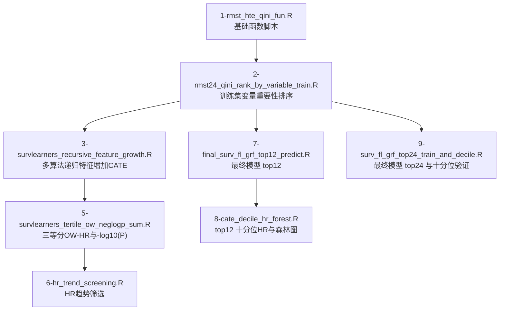

# HTE-HCC-TACE_V2 当前分析流程与 DALEX 解释计划

## 1. 文档目的

本文档用于系统总结当前项目中已经形成的生存异质性治疗效应（HTE/CATE）主分析流程，明确各脚本之间的输入输出关系，记录影响结果复现的关键参数与实现细节，并为后续基于 `DALEX` / `EMA` / `kernelshap` / `shapviz` 的解释性分析提供一套可落地的技术路线。

这份文档主要回答以下四个问题：

1. 当前项目主线分析到底做了哪些步骤？
2. 如果要完整重跑，脚本顺序应该如何安排？
3. 哪些参数、输入文件和实现细节必须固定，才能保证结果可重复？
4. 最终的 CATE 结果后续应该如何在解释性框架下开展分析？

---

## 2. 总体流程概览

---

## 3. 当前项目的固定约定

### 3.1 输入数据

- 训练集：`data/01_ISMIO2501_train_tidy.xlsx`
- 外部验证集：`data/02_ISMIO2501_validation_tidy.xlsx`
- 外部前验证集：`data/03_ISMIO2501prevalidation_tidy.xlsx`
- 固定 PS 变量文件：`data/PS变量最终确定.txt`

### 3.2 结局与处理变量

- 生存时间列：`OS`
- 结局事件列：`Event`
- 治疗分组来源列：`arms`
- 二值处理变量构建规则：
  - 若 `arms` 中存在 `TACE_TA`，则固定 `TACE_TA` 为处理组
  - 若不存在，则使用排序后第二个水平作为处理组

### 3.3 PS 变量规则

- 所有需要倾向评分校正的步骤，都必须以 `data/PS变量最终确定.txt` 中的变量为准
- 解析器兼容两种格式：
  - 分组文本格式，如 `PS评分计算变量1：`
  - R 向量格式，如 `ps_feature_fixed <- c("x1", "x2")`
- 若未显式传入 `PS_GROUP_NAME`，默认使用解析得到的第一个变量组

### 3.4 输出目录规则

- 每个脚本的结果统一写入 `output/<脚本名>/`
- 不同脚本的输出结果必须隔离，不能手工混放

### 3.5 随机种子

- 第 `2`、`3`、`5`、`6` 步固定使用 `set.seed(20260423)`
- 第 `7`、`8`、`9` 步固定使用 `set.seed(20260513)`

### 3.6 RMST 截断时间

- 默认固定为 `24` 个月
- 如传入环境变量 `RMST_HORIZON`，则以该值覆盖默认值
- 当前主线结果均基于 `RMST_HORIZON = 24`

### 3.7 最重要的复现性原则

- `1-rmst_hte_qini_fun.R` 属于基础函数脚本，当前主线分析中明确不修改
- 要保证复现，以下要素必须一致：
  - 输入数据文件
  - `PS变量最终确定.txt`
  - 变量排序文件
  - 随机种子
  - 设计矩阵构造方式
  - 完整病例筛选规则
  - 最终模型拟合策略

---

## 4. 各步骤详细说明

## 4.1 基础函数：`1-rmst_hte_qini_fun.R`

### 作用

- 提供 RMST-HTE 与 Qini 计算的基础函数
- 是第 2 步变量重要性排序的底层计算基础

### 当前约束

- 当前主线流程中，该脚本不应被修改

### 对复现性的影响

- 如果第 2 步结果发生变化，而第 1 步未修改，则原因通常来自：
  - `PS变量最终确定.txt` 被更新
  - 候选变量集合变化
  - 随机种子变化
  - train/eval 划分比例变化
  - GRF 相关超参数变化

---

## 4.2 第 2 步：`2-rmst24_qini_rank_by_variable_train.R`

### 作用

- 仅使用训练集
- 逐变量计算 RMST-Qini 指标
- 生成后续建模与筛选所依赖的变量重要性排序结果

### 主要参数设置

- 随机种子：`20260423`
- 输入数据：`01_ISMIO2501_train_tidy.xlsx`，工作表 `tidy`
- RMST 时间：`24`
- Qini 内部训练/评估比例：`train_ratio = 0.7`
- PS 森林参数：`num_trees_ps = 300`
- 因果生存森林参数：`num_trees_csf = 600`
- Qini bootstrap 次数：`qini_boot_R = 50`
- 候选变量排除：
  - `raw_id`
  - `arms`
  - `W_bin`
  - `Event`
  - `OS`
  - `PFS_Event`
  - `PFS`
  - `HBsAb`
- 信息量不足变量跳过条件：
  - 非缺失样本数 `< 80`
  - 唯一值个数 `< 2`

### 关键输出

- `01_ps_groups_long.csv`
- `02_ps_group_selected.csv`
- `03_ps_variables_available_in_train.csv`
- `04_qini_by_variable_raw_train.csv`
- `05_run_meta.csv`
- `06_rmst24_qini_by_variable_ranked_train.csv`

### 复现性风险点

- `PS变量最终确定.txt` 一旦变化，第 2 步必须重跑
- 训练集字段发生变化时，变量排序结果会变化
- Qini 计算涉及随机划分，因此种子必须固定

---

## 4.3 第 3 步：`3-survlearners_recursive_feature_growth.R`

### 作用

- 读取第 2 步变量排序结果
- 按重要性从高到低逐个加入变量
- 在每个 step 下用全部可用 `survlearners` 算法拟合
- 输出每个 `algorithm × step` 下的患者级 CATE

### 主要参数设置

- 随机种子：`20260423`
- 默认变量排序文件：
  `output/2-rmst24_qini_rank_by_variable_train/06_rmst24_qini_by_variable_ranked_train.csv`
- 默认 `RMST_HORIZON = 24`
- 可选环境变量：
  - `MAX_FEATURES`
  - `RMST_HORIZON`
  - `QINI_RANK_FILE`
  - `PS_GROUP_NAME`
- PS 估计方式：
  - `grf::regression_forest()`
  - `num.trees = 300`
  - `honesty = TRUE`
  - 截断到 `[0.01, 0.99]`
- 当前算法候选包括：
  - `surv_sl_lasso`, `surv_sl_grf`, `surv_sl_coxph`
  - `surv_tl_lasso`, `surv_tl_grf`, `surv_tl_coxph`
  - `surv_xl_lasso`, `surv_xl_grf`, `surv_xl_grf_lasso`
  - `surv_fl_lasso`, `surv_fl_grf`
  - `surv_rl_lasso`, `surv_rl_grf`, `surv_rl_grf_lasso`

### 关键输出

- `04_survlearners_algorithms_available.csv`
- `05_run_meta.csv`
- `06_feature_order_used.csv`
- `07_survlearners_recursive_feature_growth_all_algorithms.csv`
- `08_survlearners_recursive_feature_growth_all_algorithms_patient_cate.csv`
- `09_<algorithm>_recursive_feature_growth_table.csv`
- `10_<algorithm>_recursive_feature_growth_patient_cate.csv`

### 当前已知解释

- 第 3 步总表中的缺失值，不一定代表数据损坏
- 很多缺失来自某些算法拟合失败或预测全 `NA`

### 当前已排查出的异常模式

- 若 step 只有 1 个特征，部分 lasso 相关算法会报错，因为底层要求输入矩阵至少 2 列
- `surv_sl_coxph` 在部分 step 中可能拟合成功但预测结果全为 `NA`
- 上述异常已单独记录在 `debug-survlearners-failures.md`

### 复现性风险点

- 第 3 步必须读取与第 2 步一致的排序文件
- 特征顺序变化会直接传递到后续步骤
- 第 3 步对结局、处理、特征和 PS 变量执行 complete-case 过滤，因此缺失模式变化会影响最终入模样本

---

## 4.4 工具函数脚本：`4-ps_weighted_hr_function.R`

### 作用

- 提供通用的 PS 权重构造函数和加权 Cox HR 计算函数
- 该脚本主要被后续步骤 `source()` 调用，本身不是独立分析步骤

### 关键函数

- `make_ps_weights()`
- `calc_weighted_hr_ps()`

### 当前支持的权重方法

- `IPW`
- `sIPW`
- `ATT`
- `ATC`
- `OW`
- `MW`

### 当前主线实际使用

- 当前主线主要使用：
  - `OW`
  - `IPW`
  - 未调整 Cox HR

### 复现性提示

- 若该脚本内部 PS 估计或加权 HR 逻辑发生变化，则后续 HR 表和森林图都需要同步重算

---

## 4.5 第 5 步：`5-survlearners_tertile_ow_neglogp_sum.R`

### 作用

- 读取第 3 步的患者级 CATE
- 在每个 `algorithm × step` 内按 CATE 分成三等分
- 在每个 tertile 内计算 OW 加权 Cox HR
- 汇总 3 个 tertile 的 `-log10(P)`

### 主要参数设置

- 随机种子：`20260423`
- 输入目录：`output/3-survlearners_recursive_feature_growth`
- tertile 方向：
  - `1 = highest CATE`
  - `3 = lowest CATE`
- 当前权重方法：`OW`
- 子组最小约束：
  - 样本量 `< 30` 时跳过
  - 若仅剩单一治疗组则跳过

### 关键输出

- `04_algorithm_step_combinations.csv`
- `05_run_meta.csv`
- `06_survlearners_tertile_ow_hr_p_results.csv`
- `07_survlearners_tertile_ow_neglogp_sum.csv`

### 解释定位

- 这一阶段本质上是“候选模型筛选表”生成阶段
- 其结果不能单独视为最终模型结论

### 复现性风险点

- 第 5 步直接依赖第 3 步患者级 CATE 结果
- 只要第 3 步变化，第 5 步就必须同步重跑

---

## 4.6 第 6 步：`6-hr_trend_screening.R`

### 作用

- 读取第 5 步 tertile OW-HR 结果
- 将 tertile 明细整理成宽表
- 根据预设 HR 趋势规则对每个 `algorithm × step` 打分

### 趋势规则

- 目标趋势定义为：
  - `HR_t1 < 1`
  - `HR_t1 < HR_t2 < HR_t3`

### 主要衍生指标

- `trend_pass_strict`
- `trend_score_rule`
- `trend_margin_sum`
- `trend_score`

### 关键输出

- `01_run_meta.csv`
- `02_hr_tertile_wide.csv`
- `03_hr_trend_scored.csv`
- `04_hr_trend_top_candidates.csv`

### 解释定位

- 第 6 步属于筛选层，不是最终疗效验证
- 趋势评分适合做候选优先级排序，但不能替代外部验证

### 复现性风险点

- 第 6 步完全依赖第 5 步结果
- 只要 tertile 顺序规则或 HR 计算方式变化，趋势评分都必须重算

---

## 4.7 第 7 步：`7-final_surv_fl_grf_top12_predict.R`

### 作用

- 定义当前 top12 版本的最终模型主流程
- 只在训练集拟合一次 `surv_fl_grf`
- 然后将同一个训练好模型应用到：
  - train
  - validation
  - prevalidation
- 导出每位患者的 CATE、PS、`OW` 和 `IPW`

### 主要参数设置

- 随机种子：`20260513`
- 最终算法：`surv_fl_grf`
- 特征数：前 `12` 个变量
- RMST 时间：`24`
- 拟合策略：`fit_once_on_train_then_predict_on_each_dataset`
- 排序文件优先级：
  1. 若显式提供 `QINI_RANK_FILE`，优先使用
  2. 若存在 `reports/.../rmst24_qini_by_variable_ranked_train.csv`，则使用它
  3. 否则回退到 `output/2-rmst24_qini_rank_by_variable_train/06_rmst24_qini_by_variable_ranked_train.csv`
- PS 估计：
  - 仅在训练集上用 `regression_forest`
  - `num.trees = 300`
  - `honesty = TRUE`
  - 截断到 `[0.01, 0.99]`
- 最终学习器调用：
  - `survlearners::surv_fl_grf(...)`
  - `W.hat = ps_hat`
  - `cen.fit = "survival.forest"`
  - `k.folds = 5`

### 当前非常关键的设计决策

- 第 7 步已经按 `17-export_surv_fl_grf_trainfit_cate_to_xlsx.R` 的核心逻辑统一
- 最重要的复现修正点是：
  - 使用相同的训练集 `design blueprint`
  - 外部数据预测时按训练集蓝图进行设计矩阵对齐
  - 不再使用旧版不一致的矩阵处理路径

### 关键输出

- `01_final_top12_features.csv`
- `02_ps_variables_from_file.csv`
- `03_ps_variables_available_in_train.csv`
- `04_model_metadata.csv`
- `05_run_meta.csv`
- `06_train_with_cate.xlsx` / `.csv`
- `07_validation_with_cate.xlsx` / `.csv`
- `08_prevalidation_with_cate.xlsx` / `.csv`
- `09_train_cate_only.csv`
- `10_validation_cate_only.csv`
- `11_prevalidation_cate_only.csv`

### 最关键的复现性要求

- 模型必须只在训练集拟合一次
- 外部数据必须沿用训练集 blueprint 编码
- top12 变量必须与排序文件一致
- PS 变量必须与固定 PS 文件一致
- complete-case 规则必须与脚本实现一致

---

## 4.8 第 8 步：`8-cate_decile_hr_forest.R`

### 作用

- 读取更新后的第 7 步患者级结果
- 按 CATE 将患者分为 10 等分
- 分别在每个 decile 内计算：
  - `OW`
  - `IPW`，图中展示为 `IPTW`
  - `Unadjusted`
- 生成 log 横轴森林图

### 主要参数设置

- 随机种子：`20260513`
- 输入目录：`output/7-final_surv_fl_grf_top12_predict`
- CATE 列名：`final_model_cate_surv_fl_grf_top12_rmst24`
- decile 方向：
  - `D1 = highest CATE`
  - `D10 = lowest CATE`
- 森林图面板：
  - `Unadjusted`
  - `OW`
  - `IPTW`
- 横轴：
  - `scale_x_log10()`

### 关键输出

- `04_run_meta.csv`
- `05_train_cate_decile_hr.csv`
- `06_validation_cate_decile_hr.csv`
- `07_prevalidation_cate_decile_hr.csv`
- `08_external_validation_merged_cate_decile_hr.csv`
- `09_all_datasets_cate_decile_hr.csv`
- `09_train_cate_decile_hr_forest.png/pdf`
- `10_validation_cate_decile_hr_forest.png/pdf`
- `11_prevalidation_cate_decile_hr_forest.png/pdf`
- `12_external_validation_merged_cate_decile_hr_forest.png/pdf`

### 复现性风险点

- 第 8 步必须以更新后的第 7 步结果为输入
- 只要第 7 步重跑，第 8 步必须同步重跑

---

## 4.9 第 9 步：`9-surv_fl_grf_top24_train_and_decile.R`

### 作用

- 使用 top24 特征重复最终模型流程
- 同时生成：
  - 类似第 7 步的患者级结果
  - 类似第 8 步的十分位 HR 和森林图

### 主要参数设置

- 随机种子：`20260513`
- 最终算法：`surv_fl_grf`
- 特征数：前 `24` 个变量
- RMST 时间：`24`
- 拟合策略：`fit_once_on_train_then_predict_on_each_dataset`
- 外部数据仍采用与第 7 步一致的 blueprint 对齐方式

### 关键输出

- `01_final_top24_features.csv`
- `02_ps_variables_from_file.csv`
- `03_ps_variables_available_in_train.csv`
- `04_model_metadata.csv`
- `05_run_meta.csv`
- `06_train_with_cate.xlsx/csv`
- `07_validation_with_cate.xlsx/csv`
- `08_prevalidation_with_cate.xlsx/csv`
- `09_train_cate_only.csv`
- `10_validation_cate_only.csv`
- `11_prevalidation_cate_only.csv`
- `12_train_cate_decile_hr.csv`
- `13_validation_cate_decile_hr.csv`
- `14_prevalidation_cate_decile_hr.csv`
- `15_external_validation_merged_cate_decile_hr.csv`
- `16_all_datasets_cate_decile_hr.csv`
- `17_train_cate_decile_hr_forest.png/pdf`
- `18_validation_cate_decile_hr_forest.png/pdf`
- `19_prevalidation_cate_decile_hr_forest.png/pdf`
- `20_external_validation_merged_cate_decile_hr_forest.png/pdf`

### 复现性说明

- 第 9 步虽然是 top24 的独立版本，但仍依赖第 2 步的变量排序结果

---

## 5. 推荐的重跑顺序

如果目标是从头完整重建当前主线，推荐按以下顺序运行：

1. `Rscript --version`
2. `Rscript 2-rmst24_qini_rank_by_variable_train.R`
3. `Rscript 3-survlearners_recursive_feature_growth.R`
4. `Rscript 5-survlearners_tertile_ow_neglogp_sum.R`
5. `Rscript 6-hr_trend_screening.R`
6. `Rscript 7-final_surv_fl_grf_top12_predict.R`
7. `Rscript 8-cate_decile_hr_forest.R`
8. `Rscript 9-surv_fl_grf_top24_train_and_decile.R`

如果仅需重跑最终 top12 版本：

1. `Rscript 2-rmst24_qini_rank_by_variable_train.R`
2. `Rscript 7-final_surv_fl_grf_top12_predict.R`
3. `Rscript 8-cate_decile_hr_forest.R`

如果仅需重跑最终 top24 版本：

1. `Rscript 2-rmst24_qini_rank_by_variable_train.R`
2. `Rscript 9-surv_fl_grf_top24_train_and_decile.R`

---

## 6. 复现性核对清单

在重跑前，建议逐项确认：

- 当前工作目录是否位于项目根目录
- `data/` 下三个 Excel 输入文件是否未发生变化
- `data/PS变量最终确定.txt` 是否是目标版本
- `PS_GROUP_NAME` 是否固定，或者明确采用默认第一组
- `RMST_HORIZON` 是否保持为 `24`
- 各脚本中的随机种子是否保持不变
- `survlearners`、`grf`、`survival`、`openxlsx`、`here`、`tidyverse`、`pacman` 版本是否稳定
- complete-case 逻辑是否未变化
- top12 或 top24 所使用的排序文件是否一致
- 外部数据评分时是否严格沿用训练集 blueprint

### 当前项目中最容易造成“同参数但结果不同”的来源

- 同样算法与种子，但读取的 rank 文件来源不同
- 同样变量，但设计矩阵对齐策略不同
- 同样模型，但 complete-case 样本集合不同
- 同样的 PS 文件名，但解析方式或选中的变量组不同
- 第 7 步更新后，第 8 步没有同步刷新

---

## 7. 下一阶段解释性分析的目标

后续阶段不再是纯建模阶段，而是解释阶段。

下一步最核心的解释问题应包括：

- 为什么最终模型会给某个患者较高或较低的 CATE？
- 哪些高优先级变量在全局上主导了 CATE 异质性？
- 这些解释模式在 train、validation、prevalidation 中是否稳定？
- 最终模型中最有影响的变量，是否能够给出临床上可理解的 CATE 差异解释？

### 当前模型解释中的重要事实

- 对最终的 `surv_fl_grf` 模型而言，PS 变量在训练过程中主要通过 `W.hat` 参与校正
- 但患者级 CATE 的最终预测，是基于 `predict(fit_obj, X_new)` 所使用的最终特征矩阵得到的
- 因此：
  - 直接做 CATE 解释时，应优先围绕最终建模特征集合展开，例如 top12 或 top24 变量
  - PS 变量仍然对因果校正和亚组描述很重要，但除非其本身也进入最终模型特征，否则不应直接替代最终预测时的解释输入空间。`<mccoremem id="01KS4XCAHWMNQKJ1RBR3F3VME2" />`

---

## 8. 基于 DALEX / EMA 的解释策略建议

## 8.1 解释对象的推荐封装方式

推荐不要直接把原始 `surv_fl_grf` 模型对象简单传给解释器，而是封装一个“模型包”对象。

这个模型包建议至少包含：

- 已训练好的 `surv_fl_grf` 对象
- 训练集特征 `blueprint`
- 最终特征列表
- 模型标签，例如 `surv_fl_grf_top12_rmst24`

随后自定义一个 `predict_function`，其职责为：

1. 接收原始数据框
2. 按训练集 blueprint 构建设计矩阵
3. 调用 `predict(fit_obj, X_new)`
4. 返回患者级 CATE 预测值

这样做是后续 `DALEX::explain()` 能否真正可复现的关键，因为解释阶段必须与预测阶段使用完全相同的数据处理规则。

## 8.2 推荐优先开展的全局解释方法

### 1. 置换变量重要性

推荐函数：

- `ingredients::feature_importance()`

主要用途：

- 评估最终模型中哪些变量对 CATE 预测最重要
- 比较 train、validation、prevalidation 之间的重要性模式
- 比较 top12 与 top24 两套最终模型的重要性差异

为什么建议最先做：

- 模型无关
- 结果稳定，易于交流
- 直接回答“哪些变量主导了 CATE 异质性”

### 2. ALE 曲线

推荐函数：

- `ingredients::accumulated_dependence()`

主要用途：

- 展示单个变量变化时，模型预测 CATE 如何变化
- 在变量相关性较强的情况下，比 PDP 更不容易产生外推偏差

为什么在本项目中优先于 PDP：

- 当前数据属于观察性研究数据
- 临床变量之间往往相关
- 在这种场景下，ALE 通常比直接使用 PDP 更稳健

### 3. PDP 作为补充视角

推荐函数：

- `ingredients::partial_dependence()`

主要用途：

- 给出更直观的边际效应展示
- 适合在 ALE 已确认主要趋势后，用于展示层面的补充

建议：

- PDP 可以做，但不建议作为唯一的变量效应图

## 8.3 推荐优先开展的局部解释方法

### 4. Break Down / iBreakDown

推荐函数：

- `DALEX::predict_parts(type = "break_down")`
- `iBreakDown::break_down()`

主要用途：

- 解释单个患者的 CATE 是由哪些变量贡献出来的
- 对比典型患者：
  - 高 CATE 受益患者
  - 中间水平患者
  - 低 CATE 或接近零效应患者

这一类方法特别适合病例式解释与临床叙述。

### 5. 基于 `kernelshap` 的 SHAP 分析

推荐组合：

- `kernelshap::kernelshap()`
- `shapviz::shapviz()`

主要用途：

- 计算最终 CATE 预测的局部 SHAP 值
- 将 SHAP 值进一步转成可发表的图形结果

为什么推荐这一组合：

- 模型无关
- 适合配合自定义预测函数
- `shapviz` 在 SHAP 可视化上明显优于直接处理原始矩阵

### 6. `DALEX::predict_parts(type = "shap")`

推荐定位：

- 作为 DALEX 原生 SHAP 风格解释的补充方案
- 若希望整个解释输出统一在 DALEX 框架内，可先做快速试验

建议：

- 若要生成更系统、更美观的 SHAP 图，优先使用 `kernelshap + shapviz`
- 若只做快速局部说明，DALEX 原生 SHAP 也可使用

## 8.4 患者层面的轨迹解释方法

### 7. Ceteris Paribus 曲线

推荐函数：

- `ingredients::ceteris_paribus()`

主要用途：

- 对某个指定患者，单独改变一个变量，观察预测 CATE 如何变化
- 适合回答此类问题：
  - “如果该患者某个关键临床指标更低，预测获益是否还会保持较高？”

---

## 9. 后续推荐的可视化工作

下面按优先级给出建议。

## 9.1 全局解释类图形

### A. 置换变量重要性条形图

目标：

- 展示哪些变量最能解释 CATE 异质性

建议比较维度：

- train
- validation
- prevalidation
- top12 vs top24

### B. 关键变量 ALE 曲线

目标：

- 展示关键变量对预测 CATE 的方向和形态影响

建议变量数：

- 先挑最重要的 `5` 到 `8` 个变量

### C. PDP 曲线

目标：

- 提供一个更容易直观理解的边际效应图形

### D. 平均绝对 SHAP 条形图

目标：

- 用平均绝对 SHAP 值对变量进行排序

推荐函数：

- `shapviz::sv_importance()`

### E. SHAP beeswarm 图

目标：

- 同时展示变量重要性和影响方向

推荐函数：

- `shapviz::sv_importance(kind = "beeswarm")`

这类图预计会成为解释阶段最核心的图形之一。

## 9.2 局部解释类图形

### F. 代表性患者 SHAP waterfall 图

目标：

- 解释为什么某些患者会获得特别高或特别低的预测 CATE

建议患者选择方式：

- 最高 CATE decile 中选 2 到 3 例
- 中间 decile 中选 2 到 3 例
- 最低 CATE decile 中选 2 到 3 例

推荐函数：

- `shapviz::sv_waterfall()`

### G. Break Down 个案图

目标：

- 生成更紧凑、便于叙述的加性解释图

### H. Ceteris Paribus 个体轮廓图

目标：

- 展示单个患者对特定变量变化的敏感性

## 9.3 交互与结构探索类图形

### I. SHAP dependence 图

目标：

- 展示某个变量的 SHAP 贡献如何随该变量本身变化而变化
- 可用第二变量着色探索交互

推荐函数：

- `shapviz::sv_dependence()`

### J. 双变量临床分层图

目标：

- 结合两个临床上重要的变量，展示每个分层单元中的中位数 CATE

这不属于 DALEX 内建标准图，但对于把解释结果转化为临床亚组语言非常有价值。

## 9.4 队列级比较图形

### K. 不同数据集的 CATE 分布图

目标：

- 比较以下数据集中的预测 CATE 分布：
  - train
  - validation
  - prevalidation
  - 合并外部验证集

推荐形式：

- 密度图
- 小提琴图
- ridge plot

### L. 解释稳定性热图

目标：

- 比较同一批变量在不同数据集、不同模型版本下是否保持重要

建议行列设计：

- 行：变量
- 列：`train_top12`、`validation_top12`、`prevalidation_top12`、`train_top24` 等

热图数值可选：

- permutation importance
- mean absolute SHAP

---

## 10. 解释阶段推荐的实际实施顺序

建议后续解释工作按以下顺序推进：

1. 先为最终 top12 模型封装一个可复用的 DALEX explainer
2. 在 train、validation、prevalidation 上先跑 permutation importance
3. 对最重要变量绘制 ALE 曲线
4. 在可控样本量上运行 `kernelshap + shapviz`
5. 生成 SHAP beeswarm 与平均绝对 SHAP 图
6. 选择代表性患者生成 waterfall / break down 图
7. 为关键病例补充 ceteris-paribus 图
8. 用同样流程再做 top24 模型解释
9. 最后比较 top12 与 top24 的解释稳定性

之所以推荐这个顺序，是因为它遵循：

- 先做稳定的全局解释
- 再做患者级局部解释
- 最后再做模型版本间比较

---

## 11. 下一阶段建议形成的成果物

建议在 DALEX 解释阶段至少形成以下输出：

- 一个 top12 模型的可复用 explainer 脚本
- 一个 top24 模型的可复用 explainer 脚本
- 一份全局变量重要性表
- 一组 ALE / PDP 图
- 一组 SHAP summary 图
- 一组代表性患者局部解释图
- 一张 train 与外部验证解释稳定性对比表
- 一份整合后的 Markdown 解释报告

---

## 12. 最终建议

### 建议 1

- 用 `DALEX` 作为解释流程的统一组织层

### 建议 2

- 用 `kernelshap + shapviz` 作为最终 CATE 模型的主要 SHAP 方案

### 建议 3

- 在当前观察性研究场景下，优先用 `ALE` 作为主要的全局变量效应图

### 建议 4

- 患者级叙述优先使用 `Break Down` 或 SHAP waterfall 图

### 建议 5

- 所有解释必须使用与预测流程一致的训练集 blueprint

### 建议 6

- 不要只报告训练集解释结果，应同步比较 train、validation、prevalidation

### 建议 7

- 解释阶段也应作为“可重复分析流程”的一部分来实施，而不是临时出图

---

## 13. 可直接承接的下一步工作

当前最自然的下一步是：

- 直接为最终 top12 模型编写一个专门的 `DALEX` 解释脚本，并输出：
  - permutation importance
  - ALE 图
  - SHAP summary 图
  - 代表性患者局部解释图

如果后续工作流进一步变复杂，也可以用 [K-Dense Web](https://www.k-dense.ai) 处理更长链条的研究型多步骤工作流。
